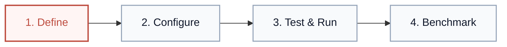

# Lyzr Agent Workspace — Designing a clearer agent-building experience

---

## 1. Overview

The Lyzr Agent Workspace redesign focused on improving the end-to-end experience of creating, configuring, testing, and evaluating autonomous AI agents. By establishing structured hierarchy, predictable panel ergonomics, and unified design tokens, the redesign makes complex multi-modal agent configuration approachable and transparent while keeping all existing product capabilities and workflows completely intact.

---

## 2. The Challenge

Enterprise AI agent builders orchestrate deeply interconnected systems: foundation model selection, tool APIs, retrieval-augmented knowledge bases, cron/webhook triggers, session memory, and deterministic evaluation benchmarks.

In earlier iterations, these configuration touchpoints were scattered across disparate interfaces. Users experienced cognitive overload from:
- **Fragmented configuration mental models:** Model parameters, tools, and execution rules lived in separate contexts without clear visual correlation.
- **Ambiguous operational feedback:** Disconnect between prompt edits, active tool invocations, and live runtime behavior.
- **Unclear navigation hierarchy:** Difficult to transition fluidly between building prompt instructions, running interactive sandboxes, collaborating with Copilot, and measuring regression benchmarks.

The challenge was to synthesize these high-density technical requirements into an intuitive, calm enterprise SaaS workspace without hiding or dumbing down advanced controls.

---

## 3. Design Goals

- **Make the agent-building workflow easier to understand:** Establish an intuitive progression across the agent lifecycle (*Define → Configure → Test → Evaluate*).
- **Improve hierarchy and discoverability of configuration:** Group related operational controls into predictable modular surfaces with scannable labels and clear primary actions.
- **Create consistency across Build, Run, Copilot, and Evaluate experiences:** Unify layout structures, top navigation tabs, sidebars, typography, and color tokens across all four workflow stages.
- **Make complex agent capabilities feel approachable without oversimplifying them:** Expose granular controls (tool schemas, PII policies, memory flags, latency metrics) via clean progressive disclosure.

---

## 4. Design Approach

- **Clear Information Architecture:** Established a persistent 3-tier layout: global workspace navigation on top, contextual folder navigation on the left, and focused workbench canvas in the center.
- **Predictable Configuration Grouping:** Clustered dense settings into dedicated panels: Left Context (Persona & Rules), Center Canvas (Execution & Prompts), Right Rail (Model, Automation & Diagnostics).
- **Progressive Disclosure:** Kept core workflows front and center while tucking technical logs, raw JSON schemas, and execution traces into responsive collapsibles.
- **Refined Micro-Ergonomics:** Standardized button hierarchies, card elevations, compact metadata pills, 1px slate borders, and crisp monospace values.
- **Consistent Visual Language:** Replaced visual noise, low-contrast fills, and decorative illustrations with purposeful enterprise design tokens centered on the Lyzr coral accent.

---

## 5. Key Screens

### A. Create / Build Agent (Studio Setup)

The initial creation view guides users through the three core actions of agent development while providing immediate access to foundational model parameters and feature flags.

- **Left Rail (Agent Intent):** Captures high-level Agent Goal, inline Tools `/` invocation, and behavioral Rules.
- **Center Canvas (3-Step Lifecycle Guidance):** Introduces the core progression (*1. Describe your agent*, *2. Add tools & knowledge*, *3. Test and iterate*) above a unified task input box.
- **Right Configuration Panel:** Organizes Model selection, Automation (Schedules & Webhooks), and Feature toggles (Memory, Data Query, Responsible AI) in a compact, predictable sidebar.

---

### B. Agent Workspace / Prompt (Folders Workspace)

The dedicated prompt workbench organizes all operational configuration into a structured left navigation hierarchy with focused editing in the center canvas.

- **Left Navigation Rail (240px):** Direct, categorized access to Prompt, Tools (4 active), Knowledge (3 datasets), Triggers (2 active), Alarms, Memory, Variables, and Model Parameters.
- **Top Pipeline Status Banner:** Clear 3-step loop showing real-time agent readiness (*Define Prompt → Connect Tools → Test Sandbox*).
- **Central Prompt Canvas:** Dedicated system prompt editor with character count counter, deterministic markdown toggle, operational guardrails list, and start-from-template cards below.

---

### C. Run / Live Sandbox (Execution & Diagnostics)

The runtime environment provides an interactive testing suite to validate prompt behavior, execute tasks against connected tools, and inspect deterministic traces.

- **Quick Task Starters:** One-click sample prompt chips (*Competitive pricing*, *Triage emails*, *Audit system uptime*) to immediately exercise agent logic.
- **Execution Step Traces:** Collapsible structured cards showing step-by-step reasoning latency, loaded tool calls (Gmail, Slack, Sheets), and verified outputs.
- **Right Context Inspector:** Displays active Model (GPT-5.4 Luna), connected tool badges, session history timeline, and credit balance meters.

---

### D. Copilot (In-Context Collaboration)

Copilot acts as an autonomous pair-programmer and prompt engineer alongside the workspace, synthesizing instructions and safety guardrails in real time.

- **Split-Screen Ergonomics:** Prompt editor remains fully editable on the left while Copilot suggestions stream into the dedicated right panel.
- **One-Click Action Pills:** Rapid prompts for *Generate full agent prompt*, *Add test coverage*, and *Add production monitoring*.
- **Direct Apply Button:** Copilot recommendation blocks include an instant *Apply to Agent Instructions* CTA to commit verified changes without copy-pasting.

---

### E. Evaluate / Benchmark (Regression & Safety Suite)

The benchmark screen transforms raw test logs into an actionable quality dashboard, validating agent resilience before production deployment.

- **Executive KPI Cards:** High-level overview of P50 Latency (416ms), Safety & Guardrail Pass Rate (100%), and Token Usage (476 tokens).
- **Automated Test Assertion Table:** Granular regression rows displaying exact test names (*Customer Triage*, *Security Guard*, *Tool Calling*), tags (*Accuracy*, *Safety*, *RAG Quality*), latency, token consumption, and pass/fail badges.

---

## 6. UX Improvements

| UX Dimension | Before Redesign | After Redesign |
| :--- | :--- | :--- |
| **Primary Actions** | Dispersed, low-contrast buttons with inconsistent weights. | Prominent coral CTAs (*Save Changes*, *Run Benchmark*, *Deploy*) with consistent sizing and keyboard accessibility. |
| **Configuration Grouping** | Configuration scattered across disjointed submenus. | Modular, predictable 3-column layout: Inputs on left, Canvas in center, Parameters on right. |
| **Visual Hierarchy** | Flat typography and ambiguous borders causing eye fatigue. | Explicit typographic scale, clear contrast between headers and metadata, and subtle 1px slate divider lines. |
| **Execution Diagnostics** | Raw console JSON dumps requiring technical deciphering. | Clean *Execution Step Traces* cards with status badges, millisecond timings, and collapsible details. |
| **In-Context Assistance** | Modal overlays interrupting builder focus. | Persistent, non-blocking side Copilot panel that updates prompt canvas in real time. |
| **Evaluation Metrics** | Fragmented log files and disconnected test outputs. | Scannable executive KPI tiles paired with an assertion test matrix showing latency, tokens, and safety. |

---

## 7. Design System Foundations

A disciplined enterprise design token system built for high-density clarity and effortless scanning.

### Color Palette

| Role | Token / Hex | Application |
| :--- | :--- | :--- |
| **Primary Brand** | `#BE4C3F` (Lyzr Coral) | Primary buttons, active tabs, focus rings, key accents |
| **Primary Hover** | `#A83E32` | Interactive button and tab hover states |
| **Light Tint** | `#FDF2F0` / `#FCECEB` | Active tab backgrounds, selected badge containers |
| **Background** | `#FFFFFF` / `#FAFAFB` | Primary canvas, panel surfaces, modal backgrounds |
| **Subtle Surface** | `#F4F4F6` / `#F8FAFC` | Sidebar rails, table headers, elevated card containers |
| **Borders** | `#E2E8F0` / `#CBD5E1` | 1px clean card and panel dividing lines |
| **Text Primary** | `#0F172A` (Navy/Charcoal) | High-contrast page titles, card headings, input values |
| **Text Secondary**| `#64748B` (Muted Slate) | Descriptions, helper labels, timestamps, metadata |
| **Status Success** | `#10B981` / `#ECFDF5` | Assertion passed badges, active agent indicators |
| **Status Warning** | `#F59E0B` / `#FFFBEB` | Model parameter alerts, credit consumption notices |
| **Status Error** | `#BE4C3F` / `#FFF1F0` | Safety violations, validation errors |

### Typography

- **Font Family:** `Inter`, system-ui fallback (clean geometric sans-serif for optimal tabular and interface clarity).
- **Scale & Hierarchy:**
  - *Page Hero Title:* 22px / Bold (`text-[22px] font-bold tracking-tight`)
  - *Section Header:* 14px / Bold (`text-[14px] font-bold text-slate-900`)
  - *Card Title:* 13px / Semibold (`text-[13px] font-semibold text-slate-900`)
  - *Body Text:* 12px / Regular (`text-xs text-slate-600 leading-relaxed`)
  - *Metadata & Badges:* 10px–11px / Semibold (`text-[10px] font-bold uppercase tracking-wider`)
  - *Tabular / Metrics:* 12px Tabular Numerals (`font-mono tabular-nums text-slate-900 font-bold`)

### Key Components

- **Navigation Items & Tabs:** Clean pill and underline states with coral highlight indicators.
- **Configuration Cards:** Solid white containers with subtle 1px slate borders and 2xs elevation.
- **Metric Tiles:** High-density KPI cards pairing large numeric readouts with status icons and baseline delta chips.
- **Tool & Knowledge Chips:** Compact rounded badges with authentic product vector icons (Slack, Google Sheets, Gmail).
- **Execution Step Rows:** Interactive trace rows with checkmark badges, operation tags, and execution duration.
- **Assertion Table:** Structured test grid with clear visual separation between assertion queries, tags, and pass states.

### Layout Principles

- **8px Spatial Grid:** Strict 8px baseline rhythm across margins (24px/32px), internal card padding (16px/20px), and element gaps (8px/12px).
- **Border & Corner Radius:** Consistent 8px (`rounded-lg`), 12px (`rounded-xl`), and 16px (`rounded-2xl`) corners with crisp 1px borders.
- **Panel Alignment:** Top-aligned panel headers across all split views to establish a balanced horizontal horizon.

### Functional Iconography

- **Icon Set:** Clean, functional line icons (`lucide-react`) at consistent 14px, 16px, and 18px scales.
- **Purpose-Driven:** Icons strictly represent concrete actions (*Run*, *Save*, *Copy*, *Expand*, *Filter*) rather than decorative illustration.

---

## 8. Interaction & Micro-Motion

- **Predictable Hover States:** Subtle 1-pixel border contrast shifts (`hover:border-slate-300`) and slight elevation rises (`hover:shadow-md`).
- **Tab & Route Transitions:** Instant, latency-free state swaps preserving scroll position and prompt buffer memory.
- **Collapsible Traces:** Smooth 150ms ease-out expand/collapse toggling execution details without jarring canvas shifts.
- **Contextual Copilot Streaming:** Non-blocking real-time text streaming with animated thinking indicators and instant markdown parsing.
- **Clear Affirmative Feedback:** Lightweight corner toast alerts (*"Applied recommendations to Goal"*, *"Copied output"*) with auto-dismissal.

---

## 9. Outcome

The Lyzr Agent Workspace redesign creates a more structured, cohesive agent-building experience while preserving the underlying product workflow and enterprise architecture. The system makes configuration, execution, collaboration, and evaluation feel like connected, harmonious stages of one unified product rather than disparate tools.

---

## 10. What I Designed

- **Agent Creation Experience:** Initial 3-step setup canvas with integrated task input.
- **Agent Configuration Panels:** Modular Model, Automation, Feature, and Guardrail settings.
- **Prompt Workspace:** Focused prompt editor with deterministic markdown controls and template gallery.
- **Tools & Knowledge Architecture:** Standardized integration chips and data connection points.
- **Model Configuration Hub:** Model selector modal with multi-provider latency and reasoning parameters.
- **Copilot In-Context Interaction:** Non-blocking pair-programming panel with automated prompt generation and 1-click instruction commits.
- **Live Execution Sandbox:** Interactive chat and task runner testing suite.
- **Execution Diagnostics:** Collapsible step-by-step trace components with millisecond metrics.
- **Benchmark & Evaluation Dashboard:** Executive regression KPI overview and granular assertion matrix.
- **Design System & Component Library:** Comprehensive color tokens, typography scales, buttons, badges, tables, and states.
